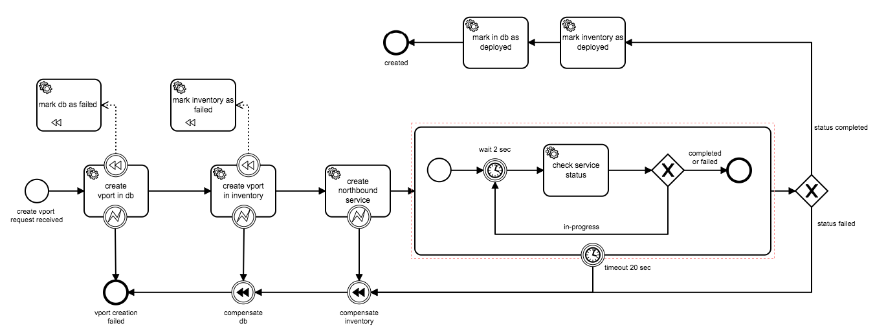

PoC application based on Camunda BPMN engine
--------------------------------------------



How to run
----------

Launch Camunda BPM platform
```bash
docker pull camunda/camunda-bpm-platform:latest
docker run -d --name camunda -p 8080:8080 camunda/camunda-bpm-platform:latest

```

Deploy `create-vport.bpmn` process.
See [instruction](https://docs.camunda.org/get-started/quick-start/deploy/) for details

Launch following boot applications:
* `entry-point`
* `db-worker`
* `inventory-worker`
* `northbound-worker`
* `northbound-app`

Start vport creation by executing:
```bash
http :9001/api/vport foo=bar
```